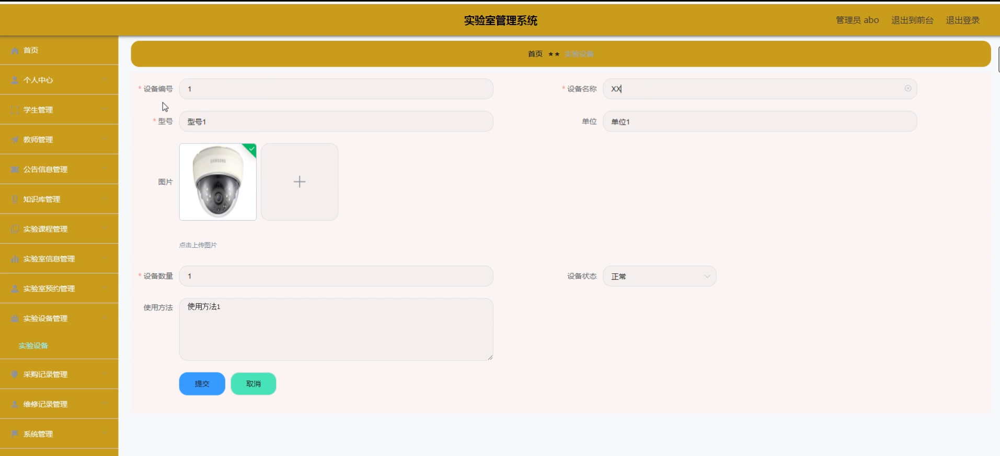

# 基于Springboot技术的实验室管理系统

#### 介绍

基于Springboot技术的实验室管理系统，旨在通过信息化手段提升实验室管理的效率和质量。系统主要服务于高校和科研机构，具备完善的实验室预约、设备管理、课程管理等功能，为管理员、教师和学生提供便捷、高效的实验室使用和管理平台。系统设计了三种角色：管理端、教师端和学生端，每个角色对应不同的功能模块，满足各自的管理和使用需求。

#### 技术栈

后端技术栈：Springboot+Mysql+Maven

前端技术栈：Vue+Html+Css+Javascript+ElementUI

开发工具：Idea+Vscode+Navicate

#### 系统功能介绍

管理端功能模块   
个人中心：管理员可以管理个人信息，包括修改密码、更新联系方式等。  
学生管理：管理员可以添加、修改、删除和查看学生信息，管理学生的实验室使用记录和预约情况。  
教师管理：管理员可以添加、修改、删除和查看教师信息，管理教师的实验课程和实验室使用记录。  
公告信息管理：管理员可以发布和管理公告信息，确保重要通知和信息及时传达到教师和学生。  
知识库管理：管理员可以管理实验知识库，包括添加、修改、删除知识条目，提供丰富的实验资源。  
实验课程管理：管理员可以管理实验课程信息，包括课程安排、课程内容和实验室分配等。  
实验室信息管理：管理员可以管理实验室的基本信息，包括实验室编号、位置、设备等。  
实验室预约管理：管理员可以查看和管理实验室的预约情况，审核和安排实验室使用时间。  
实验设备管理：管理员可以管理实验室设备信息，包括设备的添加、修改、删除和维护记录。  
采购记录管理：管理员可以管理实验室设备和材料的采购记录，跟踪采购进度和状态。  
维修记录管理：管理员可以记录和管理实验设备的维修记录，确保设备的正常运行。  
系统管理：管理员可以进行系统设置和维护，包括用户权限管理、日志查看等。  

教师端功能模块  
公告信息：教师可以查看管理员发布的公告信息，了解实验室的最新通知和安排。  
知识库：教师可以访问实验知识库，查阅和使用实验资源和资料。  
实验课程：教师可以查看和管理自己的实验课程，包括课程安排和实验室分配情况。  
实验室信息：教师可以查看实验室的详细信息，包括设备状态、使用情况等。  
个人中心：教师可以管理个人信息，包括修改密码、更新联系方式等。  
后台管理：  
公告信息管理：教师可以发布和管理实验课程相关的公告信息，通知学生实验安排和要求。  
知识库管理：教师可以管理实验知识库，添加和更新实验资料和资源。  
实验课程管理：教师可以管理自己的实验课程信息，调整课程安排和内容。  
实验室预约管理：教师可以查看和管理实验室的预约情况，安排实验时间和实验室使用。  

学生端功能模块  
公告信息：学生可以查看管理员和教师发布的公告信息，了解实验室和课程的最新通知。  
知识库：学生可以访问实验知识库，查阅实验资料和资源，辅助实验学习和操作。  
实验课程：学生可以查看自己的实验课程安排，包括实验内容、时间和实验室信息。  
实验室信息：学生可以查看实验室的详细信息，包括设备状态、使用情况等。  
个人中心：学生可以管理个人信息，包括修改密码、更新联系方式等。  
后台管理：  
实验室预约管理：学生可以提交实验室预约申请，选择实验时间和实验室。  
我的收藏管理：学生可以收藏常用的实验资料和资源，方便快速访问和使用。  

#### 系统作用

该系统的主要作用包括：  

提升实验室管理效率：通过信息化手段，实现实验室预约、设备管理、课程管理等功能的在线管理，减少人工操作，提高管理效率。  
优化实验资源利用：通过实验室预约和设备管理功能，合理分配和利用实验室资源，避免资源浪费和冲突。  
提供丰富的实验资源：通过知识库管理功能，提供丰富的实验资料和资源，辅助教师和学生的实验教学和学习。  
增强信息交流和沟通：通过公告信息和个人中心功能，实现管理员、教师和学生之间的信息交流和沟通，确保重要信息及时传达。  
个性化管理和服务：通过个人中心和收藏管理功能，使用户可以定制和管理自己的信息和常用功能，提供个性化的服务。  

#### 系统功能截图

代码结构

数据库表

登录

前台页面首页

个人中心

管理员端教师管理

实验室信息管理

实验设备管理

系统管理

教师端公告信息管理

实验课程管理

知识库

学生端后台管理

维修记录管理

#### 总结

基于Springboot框架的实验室管理系统通过科学的角色划分和详细的功能模块设计，实现了实验室管理的高效化、智能化和信息化。系统为管理员、教师和学生提供了便捷的在线服务，优化了实验室的预约、设备管理和课程安排流程，提升了实验室的管理效率和用户体验。通过知识库管理和公告信息功能，系统为实验教学提供了丰富的资源支持，促进了实验教学质量的提升。

#### 使用说明

创建数据库，执行数据库脚本 修改jdbc数据库连接参数 下载安装maven依赖jar 启动idea中的springboot项目

后台地址、http://localhost:8080/springboote51e2/admin/dist/index.html

管理员  abo 密码 abo

前台地址：http://localhost:8080/springboote51e2/front/index.html
